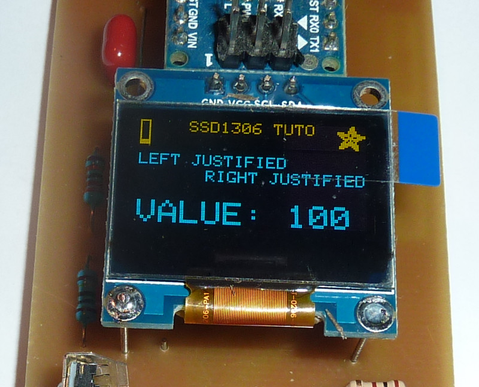
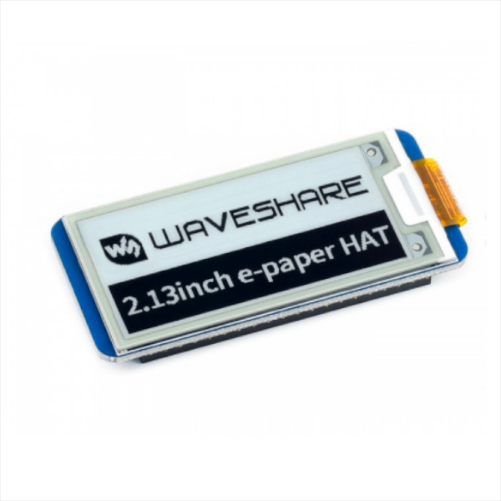

# Display
Displays are great to get visual output from your system without the need to login.
Here are different displays you can use.

## SSD1306 I2C OLED Display


### Wire it up
Connect your display to the referencing ports of your RPi
| Display | RPi |
| ---| ---|
| UCC/VCC/VDD/+ | 3,3V
G/GND/-| Ground, Mass
C/CL/SDC/SCK | Clock if I2C
D/DA/SDA | Data of I2C

### enable I2C
power up your RPi and start the config tool `sudo raspi-config`. Go to _Interfacing Options_>_I2C_ and activtate it with _Yes_. Exit the menu and restart your RPi.

If everything worked correct you can find the OLED Display Module’s Address
```bash
i2cdetect -y 1
```

If your RPi doesn't know i2cdetect install it with `sudo apt-get install -y i2c-tools`

### Python library
Install OLED Python Library
```bash
# python requirements
apt install -y python3-dev python3-pil python3-smbus python3-pil python3-pip python3-setuptools python3-rpi.gpio python3-pip
# clone the repository
git clone https://github.com/adafruit/Adafruit_Python_SSD1306.git
# navigate to the library’s directory
cd Adafruit_Python_SSD1306
# install the library for Python3
sudo python3 setup.py install
# run some examples
cd examples
python3 stats.py
```

### other libraries
https://github.com/adafruit/Adafruit_SSD1306.git
https://github.com/greiman/SSD1306Ascii.git

### Screen Size Adjustment
The Adafruit examples assume you have a 128×32 screen. They still run with a 128×64 pixel screen but it is better to change them before you move onto anything more complicated. To do this simply edit the scripts and disable the 128x32 config line by placing a `#` character at the front, and enable the 128x64 line by deleting the `#` character from the front.


## Waveshare 2.13" E-ink HAT

[Link to Waveshare](https://www.waveshare.com/2.13inch-e-paper-hat.htm)

This HAT provides 250x120 pixels e-ink with embedded controller and SPI communication. You can easily just plug it into your RPis 40 Header. If you got passive coolers or something else in the way you can also un-solder the SPI header. All while still needing a very small potion of power (Standby $<0.017mW$).

### enable SPI
The communication interface is SPI, so to use it enable it on your RPi with `sudo raspi-config`, choose _Interfacing Options_->_SPI_->_Yes_. Restart the RPi after that `sudo reboot`

### install libraries
Open terminal of Raspberry Pi and run the following commands to install corresponding libraries. Install the libraries you need, not all of them are necessary.

Install BCM2835 libraries
```bash
wget http://www.airspayce.com/mikem/bcm2835/bcm2835-1.71.tar.gz
tar zxvf bcm2835-1.71.tar.gz 
cd bcm2835-1.60/
sudo ./configure
sudo make
sudo make check
sudo make install
```

Install WiringPi libraries
```bash
sudo apt install wiringpi
wget https://project-downloads.drogon.net/wiringpi-latest.deb
sudo dpkg -i wiringpi-latest.deb
gpio -v
```
    
Install Python2 libraries
```bash
sudo apt update
sudo apt install python-pip python-pil python-numpy
sudo pip install RPi.GPIO spidev
```

Install Python3 libraries
```bash
sudo apt update
sudo apt install python3-pip python3-pil python3-numpy
sudo pip3 install RPi.GPIO spidev
```

### Demo Code & Examples
Clone demo codes from waveshare:
```bash
git clone https://github.com/waveshare/e-Paper
```

There are different examples for C and Python. 

For C examples:
```bash
# enter folder of c samples
cd ~/e-Paper/RaspberryPi\&JetsonNano/
cd c
# modify the main.c and uncomment your display
sudo nano examples/main.c
# compile code
sudo make clean
sudo make
# run the example
sudo ./epd
```

For Python example:
```bash
# enter folder of python samples
cd ~/e-Paper/RaspberryPi\&JetsonNano/
cd python/examples
# list all files for different displays
ls -al
# run a chosen example
sudo python epd_xxx_test.py
sudo python3 epd_xxx_test.py
```


# Sources and more
[SSD1306 datasheet](https://cdn-shop.adafruit.com/datasheets/SSD1306.pdf)

[Waveshare Wiki](https://www.waveshare.com/wiki/2.13inch_e-Paper_HAT) 