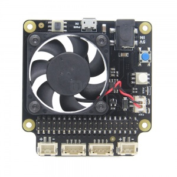

I do not get anything for writing this, i just got myself that type of power board. Feel free to look around, perhaps there are even better ones fitting your project.

# X735 Expansion Board


The X735 is a expansion board for all models (1-4) of the Raspberry Pi using a 40-pin header. It provides power management, safe shutdown, full poweroff through software and an automatic temperature controlled fan. The X735 also reserves the 40-pin header that can be stacked with other Raspberry Pi accessory boards.

At the same time, the X735 reserve two kind of 4PIN power switch (momentary and latching) port, you can connect the additional power switch to safe control the power on/power off;

## Important
- Full power off via software is not supported when using a external latching switch
- "L-SW" Jumper on X735 should be removed when using onboard switch / momentary switch
- "Auto On" Jumper on X735 should be removed when using external switch
- Both "L-SW" & "Auto On" Jumper caps should be removed when using momentary switch
- Do not power the Raspberry Pi via the Raspberry Pi's Micro-USB socket

## Features
Momentary button
- Press the momentary button or external momentary power switch to turn on
- Press the momentary button or external momentary power switch and hold for 1~2seconds to reboot
- Press the momentary button or external momentary power switch and hold for 3~7seconds to implement safe shutdown
- Press the momentary button or external momentary power switch and hold for more than 8 seconds to force shutdown
- Supports safe shutdown and full poweroff through software

Auto cooling function
- Board temperature ≤34C - Fan running at low speed
- Board temperature ≥34C - Fan running at medium speed
- Board temperature ≥45C - Fan running at full speed
- On-board LEDs show the status of fan running low and high

Supports four kinds of power supply:
- **DC5525**: Can provide up to 4A power supply capability.
- **Type C**: specially designed for Raspberry Pi 4 Model B
- **Micro USB**: Compatible with your original mirco usb power adapter
- **XH2.54 2Pin**: This is a flexible power supply


# Safe shutdown script
Tested on Raspbian Stretch 2018
```bash
# Download run script
wget https://raw.githubusercontent.com/geekworm-com/x730-script/master/x730.sh
# Setting file attributes
sudo chmod +x x730.sh
# Install the script
sudo bash x730.sh
# Setting up the command to turn off X730 from software 
printf "%s\\n" "alias x730off='sudo x730shutdown.sh'" >> ~/.bashrc
# Reboot the Raspberry Pi
sudo reboot
# Powering off the Raspberry Pi from software
x730off
```


# Source
all information (and maybe updates) can be found at [Geekworm](https://wiki.geekworm.com/X735)